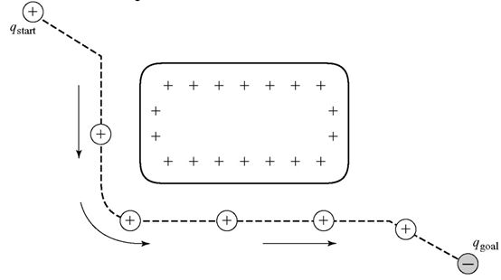

# 一、C空间

## 1、定义
构形空间（配置空间、构位空间等），也就是与机器人构形相关的空间：

+ 平面机器人，它的 C-Space 就是特殊欧式群 SE(2)：$（x,y,\theta)^\mathrm{T}$

+ 无人机，它的 C-Space 就是特殊欧式群 SE(3)：
$(x,y,x,roll,pitch,yaw)^\mathrm{T}$

+ 六轴机械臂，它的 C-Space 就是六维向量空间$R^6$,也就是人们常说的关节空间 ：$(\theta_1,\theta_2,\theta_3,\theta_4,\theta_5,\theta_6)^\mathrm{T}$

简单的说，我们可以用一组向量来完全描述机器人的空间状态，所有这组向量的集合便是 C-Space ,（注：集合 + 特定运算 = 空间，对于机器人，特定运算就是指不同Configurations之间的变换动作）。

## 2、为什么不在笛卡尔坐标系（work-space)做规划：
Work-Space 中有些场景可能规划不出。
从 C-Space 到 Work-Space 的映射是运动学正解，从 Work-Space 到 C-Space 的映射是运动学逆解。

正解：满射，在 C-Space 中规划的结果，肯定可以正确执行；

逆解：多解、奇异点等，在 W-Space 中规划的结果可能无法执行（不知道选哪个解、奇异点无法经过等）。

在 C-Space 中设计规划算法，才可能保证在有解的前提下一定能找到解。所以，对于机械臂而言，一切工作理论上都可以只在 C-Space 中完成。

+ 大多数通用规划算法都是面向 Point Agent 的：

目前各种通用规划算法都是针对点状机器人（Point Agent）设计的，如 A*, RRT 等。如果要调用一些通用运动规划库，就应该先把机器人描述成一个点。这比为每个机器人单独设计规划算法会便利很多。

而在 C-Space 中，机器人就是一个点（向量）。

https://www.zhihu.com/question/60108896/answer/224251293

# 二、人工势场法

## 1、基本原理
+ 首先，我们把构型空间比作一个电势场平面，机器人（的当前构型）比作空间中一点。如果让机器人的起点和障碍物带正电荷，终点带负电荷，机器人带正电荷。由于同性电荷相斥，异性电荷相吸的原理，机器人将会在电场力的作用下沿着某条路径向终点移动 ，并避开带正电荷的障碍物，如图1所示。

+ 我们也可以把构型空间比作一个有起伏地形的区域。其中，起点和障碍物位于较高的区域，终点位于较低的区域，机器人视作一个球体。那么在重力的作用下，机器人将沿着某条轨迹从较高的起点滑落到较低的终点，并避开较高的障碍物。如图2[2]所示。

+ 人工势场法就是在已知起点、终点和障碍物位置的情况下，构建一个人工势场来模仿这种作用机制。人工势场法的优点在于，它其实是一种反馈控制策略，对控制和传感误差有一定的鲁棒性；缺点在于存在局部极小值问题，因此不能保证一定能找到问题的解。  

## 2、引力势场和斥力势场（Additive Attractive/Repulsive Potential）
我们利用势函数 $U$ 来建立人工势场。势（场）函数是一种
可微函数，空间中某点处势函数值的大小，代表了该点的势场强度。最简单的势函数是引力/斥力势函数。其作用思路很简单：让目标对机器人产生吸引力，障碍物对机器人产生排斥力。某点 $q$ 处的势函数 $U(q)$表达为引力势和斥力势之和：

$$U(q)=\ U_{att}+U_{rep}\tag{1}$$      
+ 其中，最常见的引力势函数表达式如下：

$$U_{att}(q)=\frac{1}{2}\zeta d^2(q,q_{goal})\tag{2}$$

$\zeta——引力增益$

$d(q,q_{goal})——当前点q到目标点q_{goal}之间的距离$

+ 最常见的斥力势函数表达式如下：

$$U_{rep}(q)=
\begin{cases}
\frac{1}{2} \eta(\frac{1}{D(q)}-\frac{1}{Q^*}), D(q)\leq Q^*\\
0, D(q)\geq Q^*\\
\end{cases}
\tag{3}
$$

$D(q)——点q与其最近障碍物的距离$

$\eta——斥力增益$

$Q^*——障碍物的作用距离阈值，大于此距离的障碍物不会产生斥力影响$

当然，以上引力和斥力势函数的设计在某些情况下会产生问题，因此也有许多改进方法，这个我们以后再说。

## 3、梯度下降法(Gradient Descent）
如果把某点 $q$ 处的势函数的取值 $U(q)$ 看作该点的能量大小，那么梯度 $\nabla U(q)$ 则可以看作该点的力向量，其定义为：

$$U(q)=DU(q)^\mathrm{T}=
\begin{bmatrix}
 \frac{\partial{U}}{\partial{q_1}(q)} ,...,
 \frac{\partial{U}}{\partial{q_m}(q)}
 \end{bmatrix} 
 ^\mathrm{T}
 \tag{4}
 $$

&nbsp;

可以看出，某点处梯度的方向即为势函数增长最快的方向。

而梯度下降法，就是让机器人从初始点开始，不停地沿着梯度的反方向行走，直到梯度为0。用伪代码表示如下：

+ 输入：计算$q$点处梯度$\nabla U(q)$

+ 输出：一组轨迹序列{$q(0)$,$q(1)$,...,$q(i)$}

    $q(0)=q_{start}$

    $i=0$

    $while \nabla U(q(i)) \neq 0$ &nbsp;do

    $q(i+1)=q(i)+\alpha(i)\nabla U(q(i))$

    $i=i+1$

    $end while$

    其中步长 α 的选择比较重要，如果太小，计算速度会变慢；太大，机器人可能会“跨进”障碍物中。

