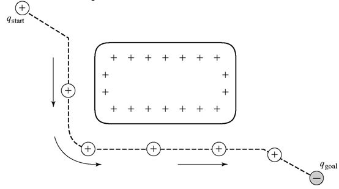
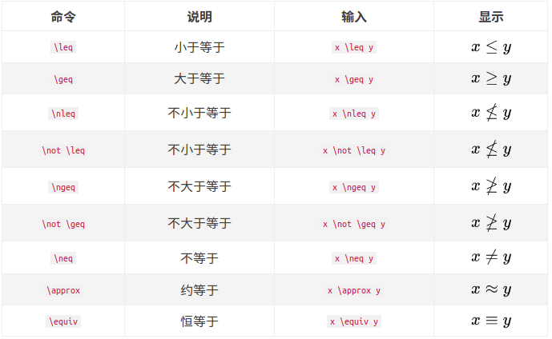
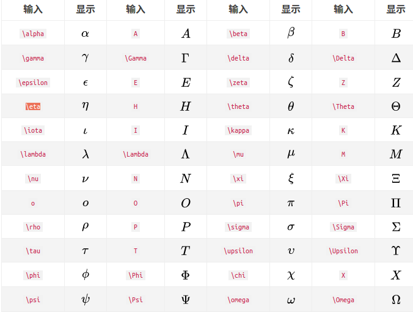
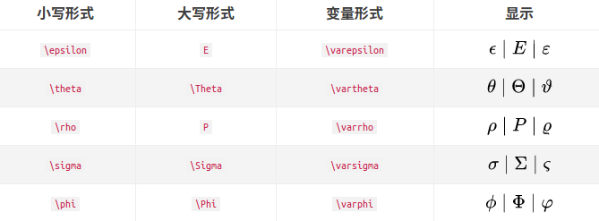

# 一、图片
## 插入

## 居中

# 二、标题
## 无序列表
+ 

# 三、公式

## 居中($$)
$$Precision=\frac{TP+TN}{TP+FN+FP+TN}$$

## 下标(_)
$$ U(q)=U_{att}+U_{rep} $$

## 转置
$(x,y,x,roll,pitch,yaw)^\mathrm{T}$

## 符号

输入 $\小写希腊字母英文全称$ 和 $\首字母大写希腊字母英文全称$ 来分别输入小写和大写希腊字母。对于大写希腊字母与现有字母相同的，直接输入大写字母即可。

https://blog.csdn.net/katherine_hsr/article/details/79179622

# 四、文字

## 颜色
kiko

##空行
&nbsp;

