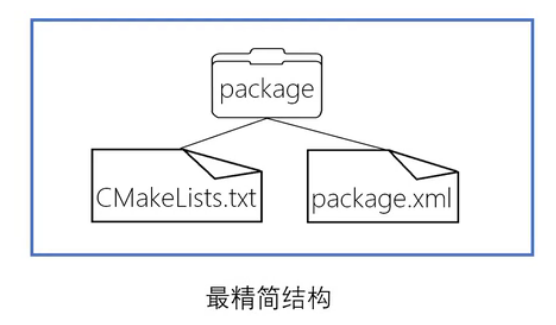

# 一、linux命令
## 1、mkdir ：创建文件或文件夹
    -p 递归创建，即使上级目录不存在，会按目录级自动创建
    如果不使用 -p，如果存在上级目录不存在的情况，会error
## 2、rmdir ：删除文件或文件夹
    -p 递归删除
## 3、source ：在当前bash环境下读取并执行FileName中的命令
    创建catkin工作空间后，在'devel'文件夹里面有几个setup.*sh文件，source这些文件中的任何一个都可以将当前工作空间设置在ROS工作环境的最顶层。
## 4、sudo : 以系统管理者的身份执行指令，也就是说，经由 sudo 所执行的指令就好像是 root 亲自执行。

## 5、sudo dpkg -i <firename>
    需要打开 .deb 所在文件夹的终端

## 6、svn

    svn checkout <github链接>

    check out跟check in对应 
    check out导出获得文件后，导出的文件仍处于SVN版本控制中，与版本库保持关联，比如你可以进行Svn Update或者Svn Commit操作。同时导出文件夹下有一个.svn的隐藏文件夹，存储着一些版本的元数据信息。

    svn export <github链接>

    export 简单导出一个版本的数据，导出的文件脱离SVN版本控制，修改后无进行Update和Commit操作。导出文件夹下没有.svn目录。

# 二、ros命令

## 1、catkin_make
### 1）创建工作空间 (必须到src，前面的名字可任取)
    mkdir -p ~/catkin_ws/src
    cd ~/catkin_ws/
    catkin_make
### 2）编译
    cd ~/catkin_ws    #回到工作空间
    catkin_make
    source  ~/catkin_ws/devel/setup.bash
    #编译完成后要source刷新环境
### 3）编译某个ros包
    首先切换到自己的ROS工作空间： $ cd ~/catkin_ws
    如果你想编译整个工作空间里面的包：$ catkin_make
    如果你只想编译工作空间某一个包：$ catkin_make  -DCATKIN_WHITELIST_PACKAGES= "包名"
    例如：
    catkin_make  -DCATKIN_WHITELIST_PACKAGES="beginner_tutorials"
### 注意：catkin workspace
    src: package源代码
    build: cmake&catkin缓存和中间文件
    devel: 目标文件（头文件、动态链接库、静态链接库、可执行文件）

## 2、catkin_create_pkg 创建catkin程序包
    $ catkin_create_pkg <package_name> [depend1] [depend2] [depend3]

## 2、文件系统工具
### 1）rospack ：获取软件包的有关信息
    示例：$ rospack find roscpp

### 2）roscd :直接切换(cd)工作目录到某个软件包或者软件包集当中
    实例：$ roscd roscpp
    roscd只能切换到那些路径已经包含ROS_PACKAGE_PATH环境变量中的软件包，要查看ROS_PACKAGE_PATH中包含的路径可以输入：
    $ echo $ROS_PACKAGE_PATH
#### a、roscd log :可以切换到ROS保存日记的目录下

### 3）rosls :直接按软件包的名称而不是绝对路径执行ls命令

### 4)Tab 自动完成输入
    一些ROS工具支持TAB 自动完成输入的功能，当有多个软件包是以<turtle>开头，当再次按TAB键后应该会列出所有以turtle开头的ROS软件包
    实例：roscd roscpp_tut<<< 现在请按TAB键 >>>

### 5）rosstack= ros+stack :
提供与ROS堆栈相关的信息

### 6) rosmake = ros+make : 
制作（编译）ROS程序包

# 三、创建ROS程序包（catkin)

## 1、简单的catkin工作空间：
    workspace_folder/        -- WORKSPACE
    src/                   -- SOURCE SPACE
        CMakeLists.txt       -- 'Toplevel' CMake file,provided by catkin
        package_1/
        CMakeLists.txt     -- CMakeLists.txt file for package_1
        package.xml        -- Package manifest for package_1
        ...
        package_n/
        CMakeLists.txt     -- CMakeLists.txt file for package_n
        package.xml        -- Package manifest for package_n

## 2、创建catkin工作空间
(必须到src，前面的名字可任取) 
### 1)
    $ mdkir -p ~/catkin_ws/src
    $ cd ~catkin_ws/
    $ catkin_make  ##编译 

### 2)
创建catkin工作空间后，在'devel'文件夹里面有几个setup.*sh文件，source这些文件中的任何一个都可以将当前工作空间设置在ROS工作环境的最顶层。

    $ source devel/setup.bash

### 3)
要确保安装脚本正确覆盖了您的工作区，请确保ROS_PACKAGE_PATH环境变量包含您所在的目录.

    $ echo $ROS_PACKAGE_PATH

### 附点：1）package
ROS软件的基本组织形式，catkin编译的基本单元，一个package可以包含多个可执行文件（节点）

    最简单的package就是：
        my_package/
            CMakeLists.txt
            package.xml

### 附点：2）package.xml
包括了package的描述信息,这些信息包括版本、维护者和许可协议等

## 3、创建一个catkin程序包
    使用 catkin_create_pkg 命令来创建一个名为'beginner_tutorials'的新程序包，这个程序包依赖于std_msgs、roscpp和rospy：
        $ catkin_create_pkg beginner_tutorials std_msgs rospy roscpp
这将会创建一个名为beginner_tutorials的文件夹，这个文件夹里面包含一个package.xml文件和一个CMakeLists.txt文件，这两个文件都已经自动包含了部分在执行catkin_create_pkg命令时提供的信息。

### 1）一级依赖：使用rospack depends1 命令工具来查看一级依赖包
    $ rospack depends1 beginner_tutorials
    依赖包保存在package.xml文件中

### 2）二级依赖：一个程序包还可以有好几个间接的依赖包，使用 rospack depends 可以递归检测出所有的依赖包
     $ rospack depends beginner_tutorials

## 4、编译catkin程序包

### 1)source 环境配置（setup)文件：
    source /opt/ros/kinetic/setup.bash

### 2）使用 catkin_make 来编译：
    catkin_make

catkin_make 是一个命令行工具，它简化了catkin的标准工作流程。你可以认为catkin_make是在CMake标准工作流程中依次调用了cmake 和 make。 

## 5、ROS节点（Nodes)
    Nodes: 节点，一个节点即为一个可执行文件，能执行特定任务，可以发布或接收一个话题，通过ROS与其他节点进行通信。

    Messages: 消息，消息是一种ROS数据类型，用于订阅或发布到一个话题。

    Topics: 话题，节点可以发布消息到话题，也可以订阅话题以接收消息。

    Master: 节点管理器，ROS名称服务（比如帮助节点找到彼此）。

    rosout: ROS中相当于stdout/stderr，这个节点用于收集和记录节点调试输出信息，所以它总是在运行的。
    roscore: master主机+rosout+参数服务器。

### 1）roscore: 是在运行所有ROS程序前首先要运行的命令。
roscore是节点和程序的集合，它们是基于ROS的系统的先决条件。 您必须运行roscore才能使ROS节点进行通信。 使用roscore命令启动它。

    $ roscore

### 2）rosnode: 显示当前运行的ROS节点信息。
    列出活跃的节点：
        $ rosnode list 
    返回关于一个特定节点的信息：
        $ rosnode info /rosout
    检查和某节点之间的通信:
        $ rosnode ping /my_turtle

        
### 3)rosrun: 允许你使用包名直接运行一个包内的节点(而不需要知道这个包的路径)
    $ rosrun [package_name] [node_name]
    例：$ rosrun turtlesim turtlesim_node

    通过命令行重新配置名称为 my_turtle：
    $ rosrun turtlesim turtlesim_node __name:=my_turtle

## 6、ROS话题(Topics)
节点之间是通过ROS Topics来互相通信的，packages则订阅该Topics以接收该消息。

### 1）使用rpt_graph
rpt_graph 能够创建一个显示当前系统运行情况的动态图形，rqt_graph是rqt程序包中的一部分。
    $ rosrun rqt_graph rqt_graph

### 2）rostopic 
rostopic命令工具能获取有关ROS话题的信息。

    a、rostopic echo：可以显示在某个话题上发布的数据。 
    例：$ rostopic echo /turtle1/cmd_vel 
    #在rpt_graph的连接线上

    b、rostopic list:能够列出所有当前订阅和发布的话题
    在rostopic list 中使用verbose选项：
    $ rostopic list -v
    会显示出有关所发布和订阅的话题及其类型的详细信息。

    c、rostopic pub：可以把数据发布到当前某个正在广播的话题上
    例子：
    $ rostopic pub -1 /turtle1/cmd_vel geometry_msgs/Twist -- '[2.0, 0.0, 0.0]' '[0.0, 0.0, 1.8]'
    {其中，-1 （单个破折号）这个参数选项使rostopic发布一条消息后马上退出， /turtle1/cmd_vel 为发布的话题名称，geometry_msgs/Twist 为发布消息的类型，-- （双破折号）这会告诉命令选项解析器接下来的参数部分都不是命令选项。这在参数里面包含有破折号-（比如负号）时是必须要添加的。}

    $ rostopic pub /turtle1/cmd_vel geometry_msgs/Twist -r 1 -- '[2.0, 0.0, 0.0]' '[0.0, 0.0, 1.8]'
    使用rostopic pub -r命令来发布一个稳定的命令流

## 7、ROS Messages
话题的类型是由发布在它上面的消息类型决定的。使用rostopic type命令可以。 

### 1)rostopic type: 查看发布在某个话题上的消息类型
    $ rostopic type /turtle1/cmd_vel

### 2)rosmg show :查看消息的详细情况
    $ rosmsg show geometry_msgs/Twist

### 3）rostopic hz: 查看数据发布的频率
    $ rostopic hz /turtle1/pose

### 4）结合rostopic type和rosmsg show命令来获取关于某个话题的更深层次的信息
    $ rostopic type /turtle1/cmd_vel | rosmsg show

### 5）rqt_plot
rqt_plot命令可以实时显示一个发布到某个话题上的数据变化图形。这里我们将使用rqt_plot命令来绘制正在发布到/turtle1/pose话题上的数据变化图形。
    $ rosrun rqt_plot rqt_plot

## 8、ROS服务
服务（services）是节点之间通讯的另一种方式。服务允许节点发送请求（request） 并获得一个响应（response）。
使用rosservice: rosservice提供了很多可以在topic上使用的命令。
    rosservice list    输出可用服务的信息
    rosservice call    调用带参数的服务
    rosservice type    输出服务类型
    rosservice find    依据类型寻找服务
    rosservice uri     输出服务的ROSRPC uri

### 1）rosservice type
    $ rosservice type clear
    
    put: std_srvs/Empty
    服务的类型为空（empty),这表明在调用这个服务是不需要参数（比如，请求不需要发送数据，响应也没有数据）

    spawn再生服务：
    $ rosservice type spawn| rossrv show

### 2) rosservice call
    rosservice call [service] [args]

## 9、rosparam
rosparam使得我们能够存储并操作ROS 参数服务器（Parameter Server）上的数据。参数服务器能够存储整型、浮点、布尔、字符串、字典和列表等数据类型。
    rosparam set            设置参数
    rosparam get            获取参数
    rosparam load           从文件读取参数
    rosparam dump           向文件中写入参数
    rosparam delete         删除参数
    rosparam list           列出参数名

### 1）rosparam list
    修改参数：rosparam set 之后，调用清除服务使得修改后的参数生效：
    $ rosservice call clear

### 2）rosparam dump
    rosparam dump [file_name]
    rosparam load [file_name] [namespace]
将所有的参数写入params.yaml文件： 
    $ rosparam dump params.yaml
将yaml文件重载入新的命名空间，比如说copy空间:  
    $ rosparam load params.yaml copy

## 10、使用rqt_console和rqt_logger_level
rqt_console属于ROS日志框架(logging framework)的一部分，用来显示节点的输出信息。rqt_logger_level允许我们修改节点运行时输出信息的日志等级（logger levels）（包括 DEBUG、WARN、INFO和ERROR）。 
    在rqt_console中的输出信息:
    $ rosrun rqt_console rqt_console

    在rqt_logger_level中修改日志等级:
    $ rosrun rqt_logger_level rqt_logger_level

### 1)日志等级：
    Fatal  最高优先级
    Error
    Warn
    Info
    Debug  最低优先级
通过设置日志等级你可以获取该等级及其以上优先等级的所有日志消息。比如，将日志等级设为Warn时，你会得到Warn、Error和Fatal这三个等级的所有日志消息。 

### 2）roslaunch: 用来启动定义在launch文件中的多个节点。
    $ roslaunch [package] [filename.launch]

#### a、注意：要先切换到beginner_tutorials程序包目录下：$ roscd beginner_tutorials
    
#### b、创建一个launch文件夹：
    $ mkdir launch
    $ cd launch

#### c、将以下内容放到新建的turtlemimic.launch文件：
    
    <launch>   #以launch标签开头以表明这是一个launch文件

        <group ns="turtlesim1">
            <node pkg="turtlesim" name="sim" type="turtlesim_node"/>
        </group>

        <group ns="turtlesim2">
            <node pkg="turtlesim" name="sim" type="turtlesim_node"/>
        </group>
        
        #创建了两个节点分组并以'命名空间（namespace)'标签来区分，其中一个名为turtulesim1，另一个名为turtlesim2，两个组里面都使用相同的turtlesim节点并命名为'sim'。这样可以让我们同时启动两个turtlesim模拟器而不会产生命名冲突。

        <node pkg="turtlesim" name="mimic" type="mimic">
            <remap from="input" to="turtlesim1/turtle1"/>
            <remap from="output" to="turtlesim2/turtle1"/>
        </node>

        #启动模仿节点mimic，并将所有话题的输入和输出分别重命名为turtlesim1和turtlesim2，这样就会使turtlesim2模仿turtlesim1。 

    </launch>   #launch文件的结束标签

#### d、roslaunch命令来启动launch文件：
    $ roslaunch beginner_tutorials turtlemimic.launch

#### e、使用rostopic pub 命令发送速度设定消息。

## 11、使用rosed编辑ROS中的文件

rosed :可以直接通过package名来获取到待编辑的文件而无需指定该文件的存储路径。

    $ rosed [package_name] [filename]
    如：$ rosed roscpp Logger.msg

rosed默认的编辑器是vim。如果想要将其他的编辑器设置成默认的，需要修改 ~/.bashrc 文件：
    $ export EDITOR='emacs -nw'
    将emacs设置成为默认编辑器。

## 12、消息(msg)和服务(srv)
    消息(msg)：msg文件就是一个描述ROS中所使用消息类型的简单文本，用来生成不同语言的源代码。
    服务(srv)：一个srv文件描述一项服务，它包含两个部分：请求和响应，由'---'分隔。

    int64 A  #其中，A和B是请求，而Sum是响应。
    int64 B
    ---
    int64 Sum

    msg文件存放在package的msg目录下，srv文件则存放在srv目录下。

在ROS中有一个特殊的数据类型：Header，它含有时间戳和坐标系信息。在msg文件的第一行经常可以看到Header header的声明。

### 1）创建一个msg

#### a、在package定义新的消息

    $ cd ~/catkin_ws/src/beginner_tutorials
    $ mkdir msg
    $ echo "int64 num" > msg/Num.msg
    （可以仿造echo添加其他消息）

#### b、查看package.xml，添加：
    <build_depend>message_generation</build_depend>
    <exec_depend>message_runtime</exec_depend>

#### c、打开CMakeLists.txt：
    利用find_packag函数，增加对message_generation的依赖，这样就可以生成消息了，直接在COMPONENTS的列表里增加message_generation。

    对于add_message_files（），去掉注释符号#，用我的.msg代替Message*.msg：
    add_message_files(
    FILES
    Num.msg
    )
    确保添加以下代码：
    generate_messages()

    

#### d、通过rosmsg show命令，检查ROS是否能够识消息：

    $ rosmsg show beginner_tutorials/Num
    
    注意：可能需要添加环境变量：
    $ gedit ~/.bashrc
    $ export ROS_PACKAGE_PATH=~/catkin_ws/src/beginner_tutorials:$ROS_PACKAGE_PATH

### 2）使用srv

#### a、创建一个srv：
    $ roscd beginner_tutorials
    $ mkdir srv

    注意：roscp是一个很实用的命令行工具，它实现了将文件从一个package复制到另外一个package的功能。
    从rospy_tutorials package中复制一个服务文件：

    使用方法：$ roscp [package_name] [file_to_copy_path] [copy_path]

    $ roscp rospy_tutorials AddTwoInts.srv srv/AddTwoInts.srv

#### b、修改CMakeLists.txt：
    查看add_service_files，删掉#，去除对语句的注释，用自己的srv文件名替换掉那些Service*.srv文件: 
    add_service_files(
    FILES
    AddTwoInts.srv
    )

#### c、使用rossrv show检查ROS是否能够识别服务：
    使用方法：
    $ rossrv show <service type>

    例子：$ rossrv show beginner_tutorials/AddTwoInts

    或者跟rosmsg类似，不指定具体的package来查找服务文件：
    $ rossrv show AddTwoInts

#### d、在MakeLists.txt中找到generate_messages：
去掉注释并附加上所有消息文件所依赖的含有.msg文件的package（不要添加roscpp,rospy）：
    generate_messages(
    DEPENDENCIES
    std_msgs
    )

由于增加了新的消息，所以我们需要重新编译我们的package：
    # In your catkin workspace
    $ cd ../..  #返回上两层目录
    $ catkin_make
    $ cd -      #返回进入此目录之前所在目录

所有在msg路径下的.msg文件都将转换为ROS所支持语言的源代码。生成的C++头文件将会放置在~/catkin_ws/devel/include/beginner_tutorials/。 Python脚本语言会在 ~/catkin_ws/devel/lib/python2.7/dist-packages/beginner_tutorials/msg 目录下创建。 lisp文件会出现在 ~/catkin_ws/devel/share/common-lisp/ros/beginner_tutorials/msg/ 路径下. 

## 13、编写简单的消息发布器和订阅器 (C++)

### 1）编写发布器节点

#### a、创建一个发布器节点（“talker")，它将不断的在ROS网络中广播消息。

   切换到之前创建的 beginner_tutorials package 路径下：
   $ cd ~/catkin_ws/src/beginner_tutorials

   在 beginner_tutorials package 路径下创建一个src文件夹,用来放置beginner_tutorials package 的所有源代码：
   $ mkdir -p ~/catkin_ws/src/beginner_tutorials/src

#### b、在 beginner_tutorials package 里创建 src/talker.cpp 文件，并将talker.cpp粘贴。
    https://raw.github.com/ros/ros_tutorials/groovy-devel/roscpp_tutorials/talker/talker.cpp

talker.cpp的文件结构：

    初始化 ROS 系统
    在 ROS 网络内广播我们将要在 chatter 话题上发布 std_msgs/String 类型的消息
    以每秒 10 次的频率在 chatter 上发布消息 
    
ros::spin() 和 ros::spinOnce() 的区别：
 这俩叫ROS消息回调处理函数。它俩通常会出现在ROS的主循环中，程序需要不断调用ros::spin() 或 ros::spinOnce()，两者区别在于前者调用后不会再返回，也就是你的主程序到这儿就不往下执行了，而后者在调用后还可以继续执行之后的程序。

ros::spin()函数一般不会出现在循环中，因为程序执行到spin()后就不调用其他语句了，也就是说该循环没有任何意义，还有就是spin()函数后面一定不能有其他语句(return 0 除外)，有也是白搭，不会执行的。ros::spinOnce()的用法相对来说很灵活，但往往需要考虑调用消息的时机，调用频率，以及消息池的大小，这些都要根据现实情况协调好，不然会造成数据丢包或者延迟的错误。

注意：
如果程序写了相关的消息订阅函数，那千万不要忘了在相应位置加上ros::spin()或者ros::spinOnce()函数，不然是永远都得不到另一边发出的数据或消息的。

ros::spinOnce()的使用注意：
1、 对于有些传输特别快的消息，尤其需要注意合理控制消息池大小和ros::spinOnce()执行频率; 比如消息送达频率为10Hz, ros::spinOnce()的调用频率为5Hz，那么消息池的大小就一定要大于2，才能保证数据不丢失，无延迟。
2、ros::spinOnce()用法很灵活，也很广泛，具体情况需要具体分析。但是对于用户自定义的周期性的函数，最好和ros::spinOnce并列执行，不太建议放在回调函数中。
参考网站：https://www.cnblogs.com/liu-fa/p/5925381.html

### 2）编写订阅器节点
    在 beginner_tutorials package 目录下创建 src/listener.cpp 文件，并粘贴如下代码：https://raw.github.com/ros/ros_tutorials/groovy-devel/roscpp_tutorials/listener/listener.cpp

listener.cpp的文件结构：
f

    初始化ROS系统
    订阅 chatter 话题
    进入自循环，等待消息的到达
    当消息到达，调用 chatterCallback() 函数 

### 3）编译节点
    修改CMakeLists.txt 文件(注意自己修改）：

    cmake_minimum_required(VERSION 2.8.3)
    project(beginner_tutorials)

    ## Find catkin and any catkin packages
    find_package(catkin REQUIRED COMPONENTS roscpp rospy std_msgs genmsg)

    ## Declare ROS messages and services
    add_message_files(FILES Num.msg)
    add_service_files(FILES AddTwoInts.srv)

    ## Generate added messages and services
    generate_messages(DEPENDENCIES std_msgs)

    ## Declare a catkin package
    catkin_package()

    ## Build talker and listener
    include_directories(include ${catkin_INCLUDE_DIRS})

    add_executable(talker src/talker.cpp)
    target_link_libraries(talker ${catkin_LIBRARIES})
    add_dependencies(talker beginner_tutorials_generate_messages_cpp)

    add_executable(listener src/listener.cpp)
    target_link_libraries(listener ${catkin_LIBRARIES})
    add_dependencies(listener beginner_tutorials_generate_messages_cpp)

注意要为可执行文件添加对生成的消息文件的依赖：

    $ add_dependencies(talker beginner_tutorials_generate_messages_cpp)

这会生成两个可执行文件, talker 和 listener, 默认存储到 devel space 目录下,具体是在~/catkin_ws/devel/lib/<package name> 中.

    

## 14、测试消息发布器和订阅器

### 1）启动发布器：
   
#### a、确保roscore可用，并运行：
    $ roscore

#### b、如果使用catkin，确保你在调用catkin_make后，在运行你自己的程序前，已经source了catkin工作空间下的setup.sh文件： 

    # In your catkin workspace
    $ cd ~/catkin_ws
    $ source ./devel/setup.bash

#### c、启动发布器"talker"：
    $ rosrun beginner_tutorials talker

### 2）启动订阅器：

#### a、新的终端同样需要切换到工作空间，并且source：

    $ cd ~/catkin_ws
    $ source ./devel/setup.bash

#### b、启动订阅器"listener":

    $ rosrun beginner_tutorials listener

## 15、编写简单的服务器和客户端(C++)

### 1）编写Service节点

#### a、创建一个简单的service节点("add_two_ints_server")
该节点将接收到两个整形数字，并返回它们的和。进入先前你在catkin workspace教程中所创建的beginner_tutorials包所在的目录：

    cd ~/catkin_ws/src/beginner_tutorials

#### b、编写Service节点
在 beginner_tutorials包中创建src/add_two_ints_server.cpp文件，编写代码.

    #include "ros/ros.h"
    #include "beginner_tutorials/AddTwoInts.h"

    bool add(beginner_tutorials::AddTwoInts::Request  &req,
         beginner_tutorials::AddTwoInts::Response &res)
    {
    res.sum = req.a + req.b;
    ROS_INFO("request: x=%ld, y=%ld", (long int)req.a, (long int)req.b);
    ROS_INFO("sending back response: [%ld]", (long int)res.sum);
    return true;
    }

    int main(int argc, char **argv)
    {
    ros::init(argc, argv, "add_two_ints_server");
    ros::NodeHandle n;

    ros::ServiceServer service = n.advertiseService("add_two_ints", add);
    ROS_INFO("Ready to add two ints.");
    ros::spin();

    return 0;
    }

#### c、编写Client节点
在beginner_tutorials包中创建src/add_two_ints_client.cpp文件，编写代码。

    #include "ros/ros.h"
    #include "beginner_tutorials/AddTwoInts.h"
    #include <cstdlib>

    int main(int argc, char **argv)
    {
    ros::init(argc, argv, "add_two_ints_client");
    if (argc != 3)
    {
        ROS_INFO("usage: add_two_ints_client X Y");
        return 1;
    }

    ros::NodeHandle n;
    ros::ServiceClient client = n.serviceClient<beginner_tutorials::AddTwoInts>("add_two_ints");
    beginner_tutorials::AddTwoInts srv;
    srv.request.a = atoll(argv[1]);
    srv.request.b = atoll(argv[2]);
    if (client.call(srv))
    {
        ROS_INFO("Sum: %ld", (long int)srv.response.sum);
    }
    else
    {
        ROS_ERROR("Failed to call service add_two_ints");
        return 1;
    }

  return 0;
}

#### d、编译节点
编辑 beginner_tutorials里面的CMakeLists.txt，文件位于~/catkin_ws/src/beginner_tutorials/CMakeLists.txt，并将下面的代码添加在文件末尾：

    add_executable(add_two_ints_server src/add_two_ints_server.cpp)
    target_link_libraries(add_two_ints_server ${catkin_LIBRARIES})
    add_dependencies(add_two_ints_server beginner_tutorials_gencpp)

    add_executable(add_two_ints_client src/add_two_ints_client.cpp)
    target_link_libraries(add_two_ints_client ${catkin_LIBRARIES})
    add_dependencies(add_two_ints_client beginner_tutorials_gencpp)

    这段代码将生成两个可执行程序"add_two_ints_server"和"add_two_ints_client"，这两个可执行程序默认被放在你的devel space下的包目录下，默认为~/catkin_ws/devel/lib/share/<package name>。你可以直接调用可执行程序，或者使用rosrun命令去调用它们。

#### e、编译
    cd ~/catkin_ws
    catkin_make

## 16、测试简单的Service Client

### 1)运行Service
    $ cd ~/catkin_ws
    $ source ./devel/setup.bash
    $ rosrun beginner_tutorials add_two_ints_server

### 2）运行Client
    打开新的终端，切换到工作空间，并且source

    $ rosrun beginner_tutorials add_two_ints_client 1 3

## 17、记录ROS系统运行时的话题数据(通过创建一个bag文件)

### 1）启动两个节点——一个turtlesim可视化节点和一个turtlesim键盘控制节点
    roscore
    rosrun turtlesim turtlesim_node 
    rosrun turtlesim turtle_teleop_key

按下键盘上的方向键应该会让turtle运动起来。

### 2)录制所有发布的话题
    rostopic list -v 
    列出的话题消息是唯一可以被录制保存到文件中的话题消息。

建立一个用于录制的临时目录，然后在该目录下运行rosbag record命令，并附加-a选项，该选项表示将当前发布的所有话题数据都录制保存到一个bag文件中：
    
    mkdir ~/bagfiles
    cd ~/bagfiles
    rosbag record -a
    系统会录制下所有节点发布的所有消息

回到turtle_teleop节点所在的终端窗口并控制turtle随处移动，再退出，检查看~/bagfiles目录中的内容，会看到一个以年份、日期和时间命名并以.bag作为后缀的文件。这个就是bag文件，它包含rosbag record运行期间所有节点发布的话题。

### 3）检查并回放bag文件
在bag文件夹所在的目录下执行：

    rosbag info <your bagfile>

### 4)回放bag文件以再现系统运行进程。
在turtle_teleop_key节点运行时所在的终端窗口中按Ctrl+C退出该节点。让turtlesim节点继续运行。

    在终端中bag文件所在目录下运行：
    rosbag play <your bagfile>

默认模式下，rosbag play命令在公告每条消息后会等待一小段时间（0.2秒）后才真正开始发布bag文件中的内容，等待时间可以通过-d选项来指定。 

最终/turtle1/command_velocity话题将会被发布，同时在turtuelsim虚拟画面中turtle应该会像之前你通过turtle_teleop_key节点控制它一样开始移动。

    通过-s参数选项让rosbag play命令等待一段时间跳过bag文件初始部分后再真正开始回放：
    rosbag play -s 2 <your bagfile>

    通过-r选项，设定一个参数来改变消息发布速率(2为倍速）：
    rosbag play -r 2 <your bagfile>

### 5）录制数据子集
当运行一个复杂的系统时，rosbag record命令支持只录制某些特别指定的话题到单个bag文件中，这样就允许用户只录制他们感兴趣的话题。 

如果还有turtlesim节点在运行，先退出他们，然后重新启动（relaunch）键盘控制节点相关的启动文件（launch file)：

    rosrun turtlesim turtlesim_node 
    rosrun turtlesim turtle_teleop_key

在bag文件所在目录下执行以下命令：

    rosbag record -O subset /turtle1/command_velocity /turtle1/pose

命令中的-O参数告诉rosbag record将数据记录保存到名为subset.bag的文件中，同时后面的话题参数告诉rosbag record只能录制这两个指定的话题。

### 6）rosbag record/play 命令的局限性

    不能完全精确地映射和刻录系统的运行行为，当处理消息的过程中系统定时发生极小变化时也会使其行为发生微妙变化

## 18、roswtf入门

确保roscore 没有运行(ROS Master 没有运行)

    $ ps -ef | grep -i rosmaster
    如果输出以roscore的一部分开始，则roscore正在运行。

### 1）检查安装
roswtf 可以检查你的ROS系统并尝试发现问题   

    $ roscd rosmaster
    $ roswtf
### 2）在有ROS节点运行时运行检查

需要让Master运行起来，所以得先启动roscore.

    $ roscore
    新终端：
    $ roscd
    $ roswtf

roscore运行了,所以roswtf做了一些运行时检查,检查过程的长短取决于正在运行的ROS节点数量。

### 3）错误报告
roswtf会对一些系统中看起来异常但可能是正常的运行情况发出警告。也会对确实有问题的情况报告错误。 

    在ROS_PACKAGE_PATH 环境变量中设置一个 bad值，并退出roscore以简化检查输出信息：
    $ roscd
    $ ROS_PACKAGE_PATH=bad:$ROS_PACKAGE_PATH roswtf

roswtf还可以发现很多其它类型的问题。如果你发现自己被一个编译或者通信之类的问题困扰的时候，可以尝试运行roswtf看能否帮你解决。 

